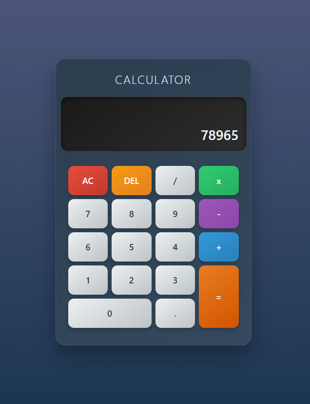

# Calculator App

A modern, responsive calculator built with React and TypeScript.

## Features

- ✅ Basic arithmetic operations (+, -, ×, ÷)
- ✅ Clear (AC) and Delete (DEL) functionality
- ✅ Decimal point support
- ✅ Chaining operations
- ✅ Modern UI with beautiful gradients
- ✅ Responsive design
- ✅ TypeScript support

## Screenshot




## Technologies Used

- React 18
- TypeScript
- CSS3 with modern gradients
- Custom hooks for state management

## Getting Started

### Prerequisites

- Node.js (version 14 or higher)
- npm or yarn

### Installation

1. Clone the repository:
```bash
git clone <repository-url>
cd calculator-fontend
```

2. Install dependencies:
```bash
npm install
```

3. Start the development server:
```bash
npm run dev
```

4. Open your browser and navigate to `http://localhost:5173`

## Usage

- **Numbers**: Click any number button to input digits
- **Operations**: Click +, -, ×, or ÷ to perform calculations
- **Equals (=)**: Press to see the final result
- **AC**: Clear all and reset the calculator
- **DEL**: Delete the last entered digit
- **Decimal (.)**: Add decimal points to numbers

